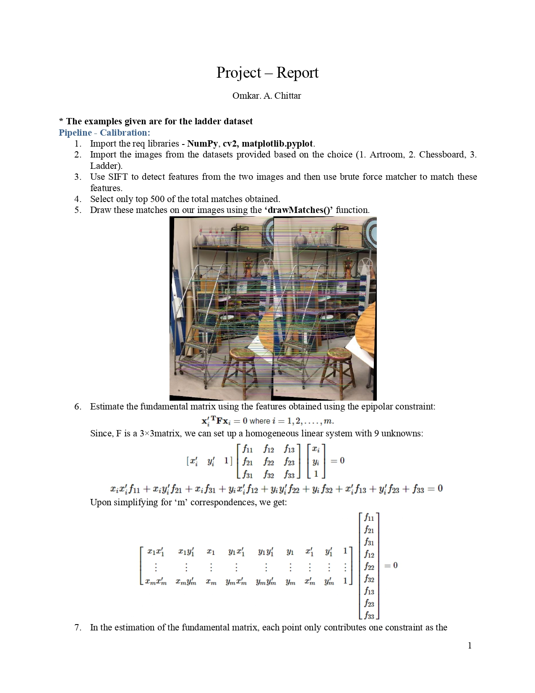
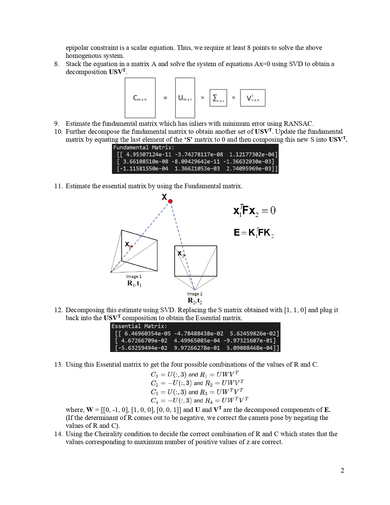
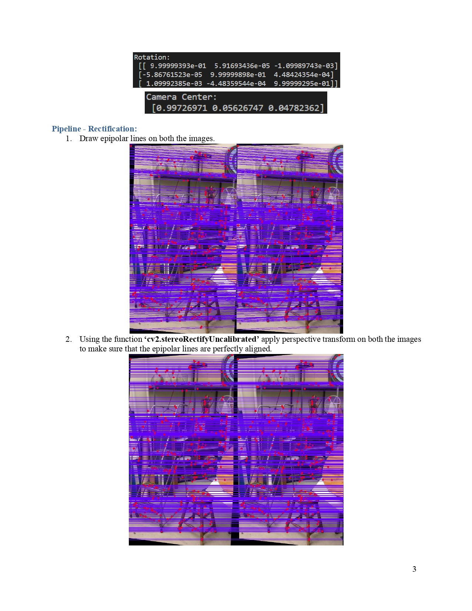
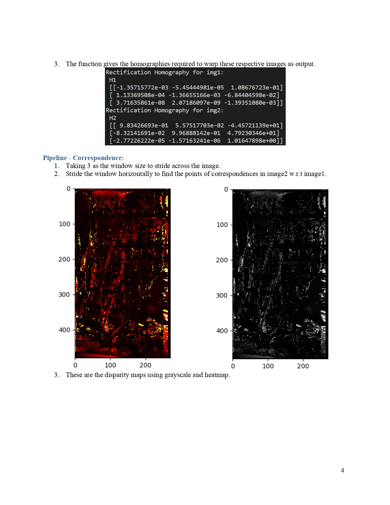
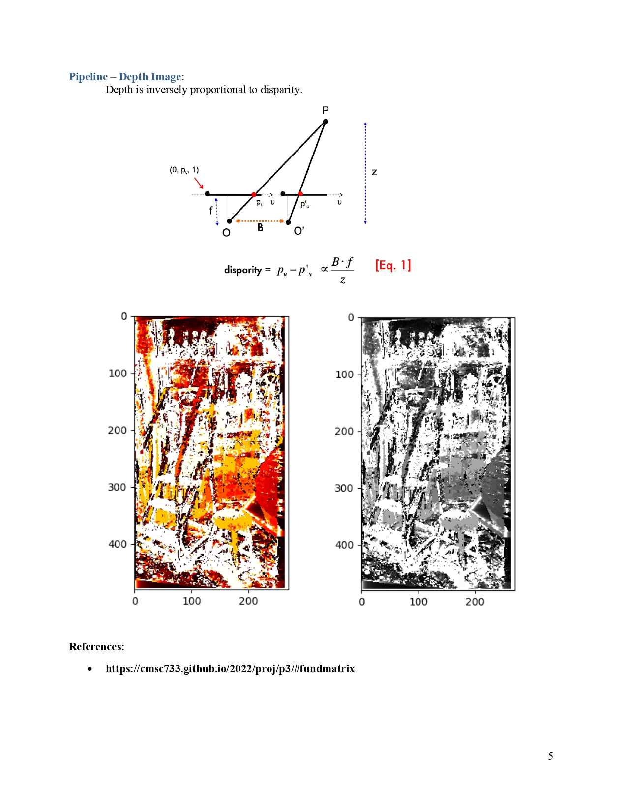

# Stereo Depth Estimation

## Overview
The code estimates the depth by creating a disparity map using the frames of a scene observed by a stereo-camera setup. This is done by correcting the epi-lines.







## **File Tree**

```
+-data
  +- artroom
    +- 2 images and calibration data
  +- chess
    +- 2 images and calibration data
  +- ladder
    +- 2 images and calibration data
+-main
+-README.md
+-report.pdf
```

Note - Please make changes in the main.py for variable "data" as "1", or "2", or "3" for artroom, chess and ladder repectively.

## **Installation and Running**

1. Download and extract the files.

2. Run the code main.py using the following command in your terminal
    ***python3 main.py***
**The terminal displays the following**:
 - Fundamental Matrix
 - Essential Matrix
 - Rotation
 - camera center
 - Rectification homographies

- 1st pop up window: matching features on the two images.
- 2nd pop up window: reprojected points
- 3rd pop up window: 

4. A detailed report of the entire project is given in ***report.pdf***  
